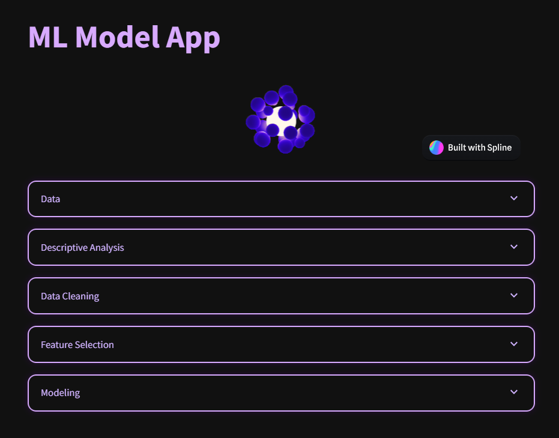

# ML Model App

A Streamlit-based interactive web application for end-to-end machine learning model development, feature selection, and evaluation.


---

## Features

- **Data Upload:** Upload CSV or Excel datasets.
- **Data Exploration:** Preview data, descriptive statistics, and feature histograms/bar plots.
- **Data Cleaning:** Visualize and drop columns based on missing value percentage.
- **Feature Selection:** Select features using model importance and correlation filtering.
- **Suspicious Feature Detection:** Warns about features with abnormally high importance.
- **Modeling:** Train and compare Random Forest, XGBoost, LightGBM, CatBoost, and Gradient Boosting classifiers.
- **Performance Visualization:** Interactive ROC curves, power loss, and confusion matrices.
- **Metrics:** Accuracy, precision, recall, F1-score for each model.

---

## Methodology

- **ML modeling methods** are explained in detail in [this repository](https://github.com/tergelitu/ml-models-for-credit-scoring-benchmark.git). This app is based on those methods and adapts them for interactive use.
- **Test data:** The app is tested using the [German Credit dataset from Kaggle](https://www.kaggle.com/datasets/uciml/german-credit).
- **UI/UX:** I'm experimenting with [Spline](https://spline.design/) to improve the UI and user experience. Suggestions for further improvements are welcome!

---

## Requirements

Install dependencies:

```sh
pip install streamlit pandas numpy plotly scikit-learn xgboost lightgbm catboost
```

---

## Usage

1. **Start the App:**
    ```sh
    streamlit run app.py
    ```
2. **Upload Data:** Use the sidebar to upload your CSV or Excel file.
3. **Explore, Clean, and Select Features:** Use the expanders to analyze, clean, and select features.
4. **Modeling:** Review ROC curves, power loss, and performance metrics for all models.

---

## File Structure

- `app.py` – Main Streamlit application.
- `app-test-data.xlsx` – Example data file (optional).
- `outcome/` – Folder containing preview results and example outputs of the app based on the test data.


---

## Notes

- The app expects a dataset with at least one target column for classification.
- Feature selection and modeling are automated but allow user adjustments.
- All visualizations are interactive and update with user selections.